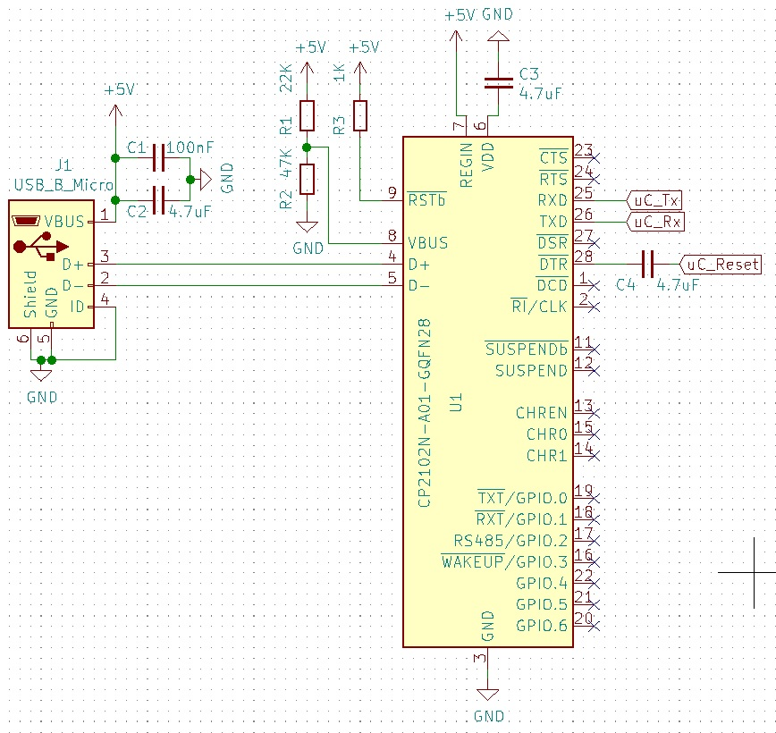

# Using the CP2102N with the 328P

This is a quick writeup of how to use the Silicon Labs CP2102N with the ATMega328p, just for future reference.  This guide details how to wire the CP2102N with a 328p on a breadboard so that the 328 can be programmed over USB as if it was an Arduino Uno.

# Why the CP2102N?

The 328p is the chip at the heart of the Arduino Uno, but it doesn't have a native USB connection, which is useful for easily uploading new programs to it.  This means that another chip is required to program it and pass serial data.  In the Uno this is done by another ATMega microcontroller, the 16u2.  Why the 16u2 was chosen I don't know, but these chips are moderately expensive (~£2) and a bit more complex than is really necessary.  Usually an FTDI FT232R would be used instead.  However, these chips cost somewhere in the region of £3+ from Farnell, and cheap chips from less well known etailers can be counterfeit.  Sometimes these don't function properly, and sometimes FTDI [decides to break them](https://hackaday.com/2016/02/01/ftdi-drivers-break-fake-chips-again/) to arm-twist people into buying genuine chips.

After "FTDI Gate" there were a lot of discussions about alternatives.  The WCH CH340 was brought up, and I wrote some [quick documentation about using it here](https://github.com/UnfinishedStuff/CH340C/blob/master/README.md).  It's a perfectly useable chip, available for ~40p each at the time of writing.  Unfortunately there aren't many suppliers, and I'm not a fan of waiting weeks for parts to arrive on the slow boat from China.  With that in mind, I started looking for chips which were more freely available in the UK.  Adafruit use the Silicon Labs CP2102N in many of their products, and it's available for ~£1.10 from Digikey, Mouser and Farnell.  Like the CH340C, it doesn't need an external crystal, although it doesn't need a couple of resistors and capacitors.

There are actually 3 version of the CP2102N, with 20, 24 or 28 pins.  In short, the 28-pin variant can talk to battery charger circuitry, the 24-pin variant has a separate pin for providing power to the UART bus (instead of being ahrd-wired to 3.3V), and the 20-pin package has neither of these.  This circuit diagram was made with the 28-pin version, but the others should be fairly similar give or take some pins moving around.

This diagram is pieced together from the datasheet (because I'm impatient and don't want to have to read through it all again).

The datasheet asks for a few more capacitors than this, namely another 100nF capacitor to ground from VDD, but this circuit has worked fine for me.  This *should* output 3.3V on the TX/RX lines, but I've not actually measured that.

According to the datasheet pins 18 and 19 indicate whether or not there is data moving across TX and RX (see Fig. 4.3 in the datasheet), but I couldn't get them to work at all.  Pins 11 and 12 can tell you whether or not the USB port is active (pin 11 goes high when data is transferred, pin 12 goes low), but personally I don't find that function particularly useful.  Figure 2.5 recommends that protection diodes are connected to D+, D- and VBUS but I've not used them and, touch-wood, never had a problem.

And that's it!  Most of the pins are for other functions which aren't required.  Under this setup a 328p chip on a breadboard should be recognised and programmed as if it was an Arduino Uno.

